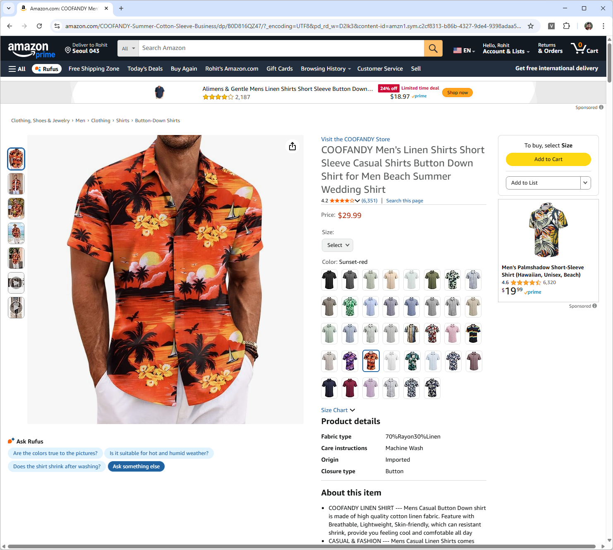
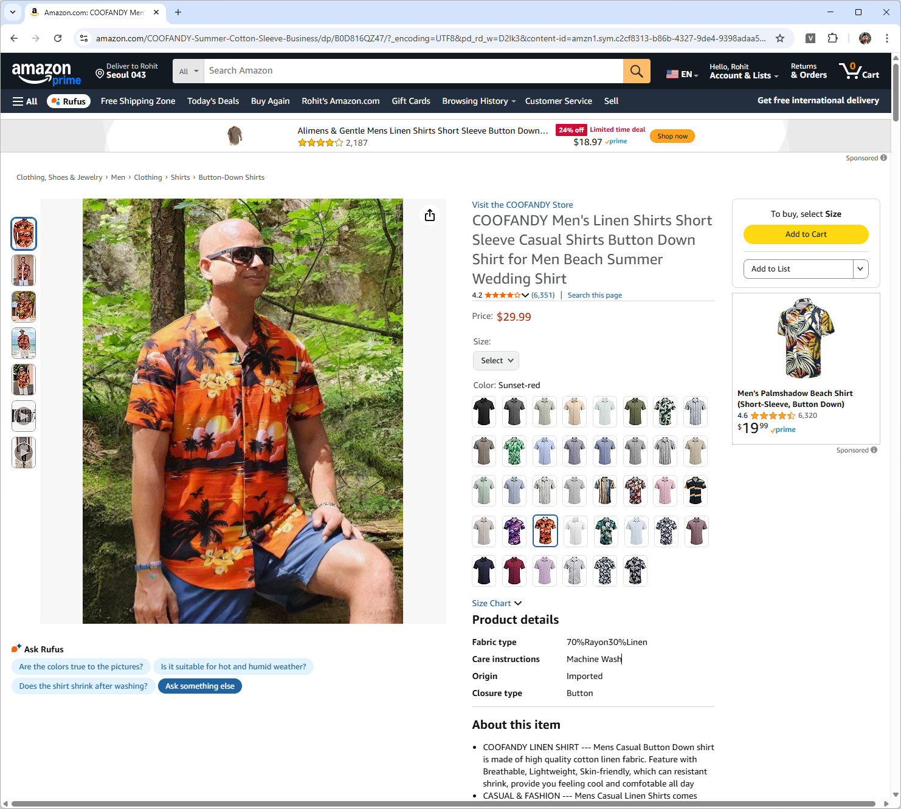

# 👗 Trial Room – AI Virtual Try-On Chrome Extension

Try on clothes virtually—right on the product page—using AI.

**Trial Room** is a Chrome extension + Flask backend that lets you preview how a garment might look on *you* while browsing supported e-commerce websites. It uses [Kolors Virtual Try-On](https://klingai.com/global/) powered by KlingAI, and supports **Coupang**, **Amazon India**, and **Amazon US**.

---

## 📸 Demo: Real Example

| Your Photo | Product Page | Try-On Result |
|------------|--------------|----------------|
|  |  |  |

---

## ✨ Features

- 🔄 Replaces product image with AI-generated try-on image
- 📷 Upload your own photo (stored safely in your browser)
- 🔐 Secure backend authentication (keys hidden via `.env`)
- ⚡ Fast, lightweight extension + Flask API
- 🛡️ [Privacy Policy](privacy-policy.md) included

---

## 🌍 Supported Sites

- ✅ [Coupang](https://www.coupang.com/)
- ✅ [Amazon India](https://www.amazon.in/)
- ✅ [Amazon US](https://www.amazon.com/)

> 💻 Desktop only. Mobile view not supported.

---

## 🧪 How to Use (Developer Version)

### 1. Install Chrome Extension

1. Go to `chrome://extensions`
2. Enable **Developer Mode**
3. Click **Load Unpacked**
4. Select the `chrome-extension/` folder
5. Upload your photo and click **Try It On**

### 2. Run Backend Flask Proxy

> This is required to handle CORS and securely generate JWTs for the KlingAI API.

1. Open the `proxy_server/` directory
2. Create a `.env` file with your KlingAI credentials:

```bash
# .env
KAI_ACCESS_KEY=your_real_access_key
KAI_SECRET_KEY=your_real_secret_key
```

3. Install dependencies:

```bash
pip install -r requirements.txt
```

4. Run the Flask proxy:

```bash
python proxy_server.py
```

It will be available at: `http://localhost:8080`

---

## 📦 Deploy to Replit (Optional)

You can host the backend on [Replit](https://replit.com/) instead of running it locally. Here's our live instance:

🔗 https://d967d59e-56b2-46f7-b1a8-b8ed50d7d449-00-6w8577xdgn8i.sisko.replit.dev/

---

## 🚀 Want to Try It Live?

1. Upload your image in the popup
2. Open a supported product page
3. Click “Try It On” in the extension
4. Voilà—see yourself styled in seconds

---

## 🙏 Credits

- [Kolors Virtual Try-On](https://klingai.com/global/)
- [Hugging Face Demo](https://huggingface.co/spaces/Kwai-Kolors/Kolors-Virtual-Try-On)
- Icons generated with AI
- Made with 💙 by [Rohit Agarwal](https://www.linkedin.com/in/agrohit/)

---

## 🔒 Privacy

We never store or share your photos. See our [Privacy Policy](privacy-policy.md) for full details.

---

## License

MIT
